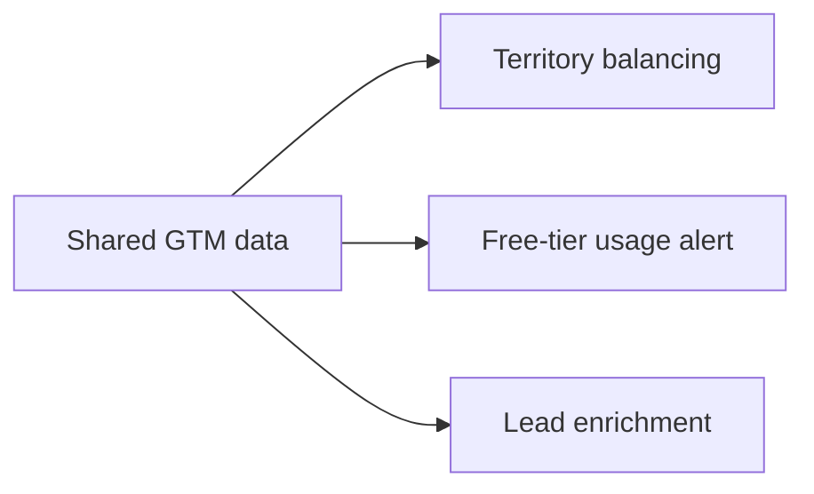

# Andrew Heo - GTM Engineering Portfolio

## Problem Statement

GTM breaks when account ownership, product signals, and CRM data stop lining up.

## Output

| Project | Business Output | Technical Details |
|---|---|---|
| `01_gtm_data_foundations` | Clean & actionable data | Data ingestion & normalization |
| `02_territory_balancer` | Balance AM territories | Territory balancing, reassignment, & Salesforce writeback |
| `03_freetier_usage_alert` | Weekly alerts to AEs on free-tier usage | Usage signal detection, Slack alerting, & Salesforce task creation |
| `04_lead_enrichment` | Lead enrichment & SFDC update | Lead intake, company-email verification, enrichment, & Salesforce update |

## Logic



One shared dataset. Multiple revenue workflows.

## Technical

- Python
- pandas / numpy
- Salesforce-style object model
- Clay-style enrichment
- Slack-style alerts
- Datadog-style usage signals

Run order:

```bash
python3 -m pip install -r requirements.txt
python3 projects/01_gtm_data_foundations/generate_data.py
python3 projects/02_territory_balancer/territory_balancer.py
python3 projects/03_freetier_usage_alert/freetier_usage_alert.py
python3 projects/04_lead_enrichment/lead_enrichment.py --scenario all
```
