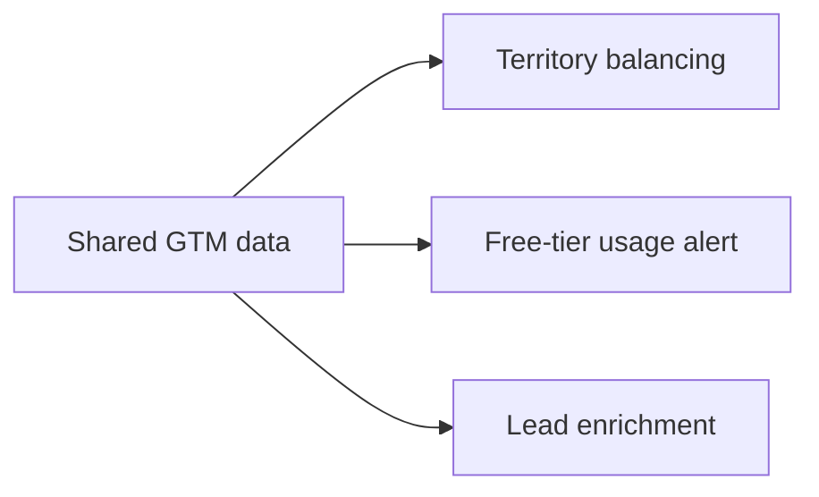

# Andrew Heo - GTM Engineering Portfolio

## Problem Statement

GTM teams break when ownership, product signals, and CRM data stop lining up. This repo shows how GTM engineering can make that system usable.

## Output

| Project | What It Produces | Why It Matters |
|---|---|---|
| `01_gtm_data_foundations` | A shared GTM dataset | Gives every workflow the same source of truth |
| `02_territory_balancer` | AM owner reassignment recommendations | Keeps SMB and Mid-Market books balanced |
| `03_freetier_usage_alert` | AE alerts for engaged free-product accounts | Turns product usage into pipeline signals |
| `04_lead_enrichment` | Routed and enriched inbound lead actions | Speeds up account matching and follow-up |

## Logic



The point is simple: one clean data model, then multiple revenue workflows on top of it.

## Technical

- Python
- pandas / numpy
- Salesforce-style object model
- Clay-style enrichment
- Slack-style alerts
- Datadog-style usage signals

Run order:

```bash
python3 -m pip install -r requirements.txt
python3 projects/01_gtm_data_foundations/generate_data.py
python3 projects/02_territory_balancer/territory_balancer.py
python3 projects/03_freetier_usage_alert/freetier_usage_alert.py
python3 projects/04_lead_enrichment/lead_enrichment.py --scenario all
```
