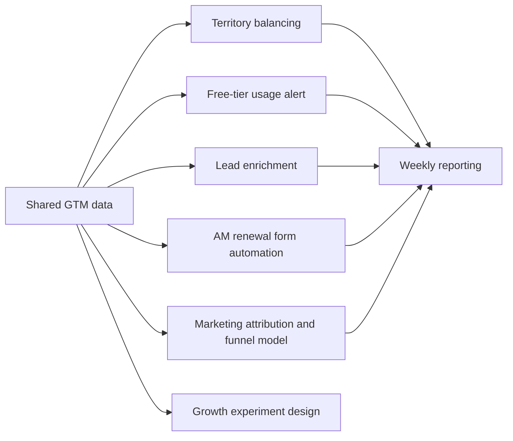

# Andrew Heo - GTM Engineering Portfolio

## Introduction

This project is an approximation of a startup GTM ecosystem: a shared GTM data layer, external tool integrations, and Python workflows that automate core BAU revenue operations.

It shows the systems and automations I would stand up early as a GTM engineer to keep CRM data, ownership, product signals, and enrichment workflows aligned.

## Output

The shared dataset simulates a Series C SaaS company at roughly `$50M ARR` from paying customers, planned to grow about `30%` over the next 12 months.

| Business Demographic | Value |
|---|---:|
| Current paid ARR | `$50.0M` |
| Next-12-month growth target | `30%` |
| Future `NNARR` pipeline | `$50.0M` |
| Planning win rate | `30%` |

| Project | Business Output | Technical Details |
|---|---|---|
| `01_gtm_data_foundations` | Clean & actionable data | Data ingestion & normalization |
| `workflows/02_territory_balancer` | Balance AM territories | Territory balancing, reassignment, & Salesforce writeback |
| `workflows/03_freetier_usage_alert` | Weekly alerts to AEs on free-tier usage | Usage signal detection, Slack alerting, & Salesforce task creation |
| `workflows/04_lead_enrichment` | Lead enrichment & SFDC update | Lead intake, company-email verification, enrichment, & Salesforce update |
| `workflows/05_am_renewal_form_automation` | AM renewal form automation | Parabola-style form processing, renewal validation, & Salesforce writeback |
| `workflows/06_marketing_attribution_and_funnel_model` | Marketing attribution & funnel source of truth | First-touch and last-touch attribution, tracking hygiene, & funnel reporting |
| `workflows/07_growth_experiment_design` | Growth experiment design for a new plan | ICP scoring, segmentation, targeting, messaging, & experiment metrics |
| `non-gtm side projects/geo_answer_key_webapp` | GeoGuessr-style answer key from an uploaded photo | Python web app, drag-and-drop upload, demo-mode answer keys, and optional multimodal image analysis |
| `reporting/*_weekly_report` | Weekly state-of-the-business reporting | Segment-level markdown reporting across GTM workflows |

## Logic



One shared GTM data layer. Multiple operational workflows.

## Technical

- shared GTM data layer
- external tool integrations
- Python workflows for BAU revenue operations
- Python
- pandas / numpy
- Salesforce-style object model
- Clay-style enrichment
- Slack-style alerts
- Datadog-style usage signals

Run order:

```bash
python3 -m pip install -r requirements.txt
python3 projects/01_gtm_data_foundations/generate_data.py
python3 projects/workflows/02_territory_balancer/territory_balancer.py
python3 projects/workflows/03_freetier_usage_alert/freetier_usage_alert.py
python3 projects/workflows/04_lead_enrichment/lead_enrichment.py --scenario all
python3 projects/workflows/05_am_renewal_form_automation/am_renewal_form_automation.py
python3 projects/workflows/06_marketing_attribution_and_funnel_model/marketing_attribution_and_funnel_model.py
python3 projects/workflows/07_growth_experiment_design/growth_experiment_design.py
python3 "non-gtm side projects/geo_answer_key_webapp/app.py"
python3 reporting/generate_weekly_reports.py
```
