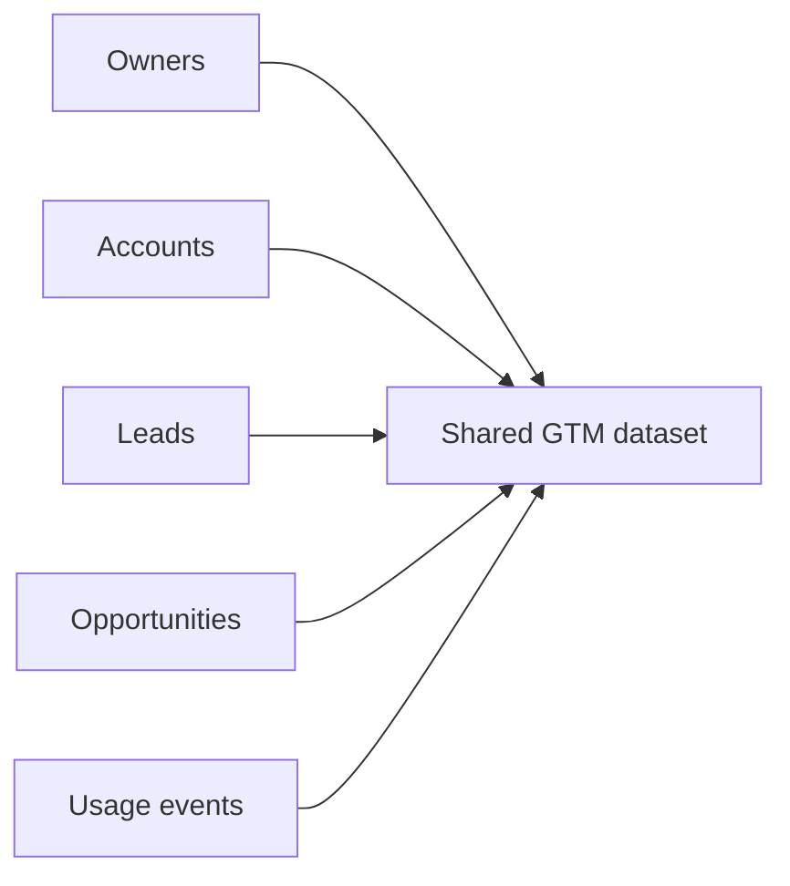

# GTM Data Foundations

## Problem Statement

Revenue workflows fail when every team is looking at a different version of the business. This project creates one operating picture for owners, accounts, leads, pipeline, and product usage.

## Output

- `owners.csv`
- `accounts.csv`
- `leads.csv`
- `opportunities.csv`
- `product_usage_events.csv`
- `output/data_summary.csv`

Current snapshot:

| Metric | Value |
|---|---:|
| Total owners | 20 |
| Paying accounts | 300 |
| Non-paying accounts | 300 |
| Leads | 180 |
| Opportunities | 210 |
| Product usage events | 5,000 |

### Account Counts

| Segment | Paying Accounts | Non-Paying Accounts |
|---|---:|---:|
| SMB | 80 | 121 |
| Mid-Market | 202 | 94 |
| Enterprise | 18 | 85 |

### Account Percentages

| Segment | Paying % of Paying Accounts | Non-Paying % of Non-Paying Accounts |
|---|---:|---:|
| SMB | 26.7% | 40.3% |
| Mid-Market | 67.3% | 31.3% |
| Enterprise | 6.0% | 28.3% |

The paying base is mostly Mid-Market. The free-product base is broader, with SMB the largest slice.

## Logic



Business rules:
- paying SMB and Mid-Market accounts are AM-owned
- paying Enterprise accounts are AE-owned
- free-product accounts are AE-owned

## Technical

- `owners.csv`: AE and AM coverage
- `accounts.csv`: canonical owner fields plus AE/AM metadata
- `leads.csv`: inbound demand with optional account match
- `opportunities.csv`: pipeline tied to accounts and AEs
- `product_usage_events.csv`: product behavior tied back to accounts

Run:

```bash
python3 projects/01_gtm_data_foundations/generate_data.py
```
