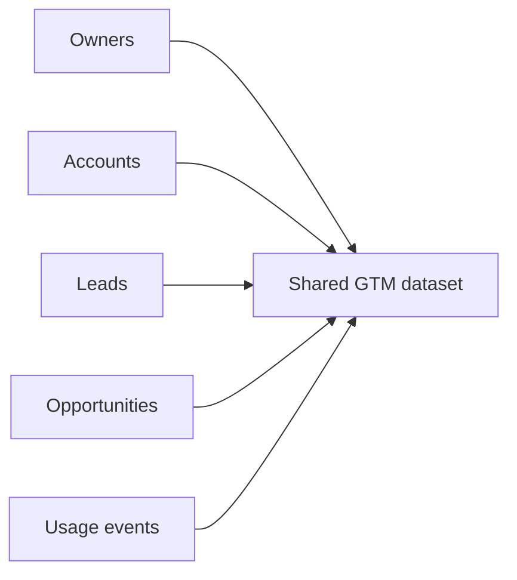

# GTM Data Foundations

## Introduction

This project creates the shared datasets used by the downstream workflows. In production, this would be the layer where core GTM inputs from systems like Salesforce and product telemetry are ingested and normalized into a canonical operating dataset.

## Output

This project acts as the shared GTM data layer for the portfolio, creating a canonical operating dataset that downstream workflows can consume.

| Metric | Value |
|---|---:|
| Total owners | 20 |
| Paying accounts | 300 |
| Non-paying accounts | 300 |
| Leads | 180 |
| Opportunities | 210 |
| Product usage events | 5,000 |

### Modeled Timeframe

| Dataset | Modeled Window |
|---|---|
| Leads | Past 180 days |
| Opportunities | Past 365 days of pipeline creation |
| Usage events | Past 7 days |

This means the lead file shows recent demand, the opportunity file shows the last year of pipeline creation, and the usage file shows the last week of product engagement in one normalized operating view.

### Account Counts

| Segment | Paying Accounts | Non-Paying Accounts |
|---|---:|---:|
| SMB | 80 | 121 |
| Mid-Market | 202 | 94 |
| Enterprise | 18 | 85 |

### Account Percentages

| Segment | Paying % of Paying Accounts | Non-Paying % of Non-Paying Accounts |
|---|---:|---:|
| SMB | 26.7% | 40.3% |
| Mid-Market | 67.3% | 31.3% |
| Enterprise | 6.0% | 28.3% |

The paying base is concentrated in Mid-Market. The free-product base is broader, with SMB the largest slice.

## Logic



Business rules:
- paying SMB and Mid-Market accounts are AM-owned
- paying Enterprise accounts are AE-owned
- free-product accounts are AE-owned

## Technical

- synthetic GTM source generation
- canonical dataset creation across owners, accounts, leads, opportunities, and usage events
- normalized CSV outputs with modeled time windows for downstream workflows
- `owners.csv`
- `accounts.csv`
- `leads.csv`
- `opportunities.csv`
- `product_usage_events.csv`
- `output/data_summary.csv`

Run:

```bash
python3 projects/01_gtm_data_foundations/generate_data.py
```
