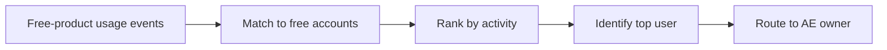

# Free-Tier Usage Alert For AEs

## Problem Statement

Free-product activity is easy to ignore until it becomes a missed pipeline opportunity. This project turns engaged free-product usage into an AE follow-up list.

## Output

- `output/free_tier_usage_alerts.csv`
- `output/slack_message_payload.csv`
- `output/salesforce_tasks.csv`

What comes out:
- ranked free-product accounts by recent engagement
- the most active user for each account
- AE-ready Slack and Salesforce follow-up payloads

## Logic



This workflow uses canonical account ownership. For free-product accounts, that owner is always the AE.

## Technical

- looks back 7 days
- uses free-product accounts only
- ranks by total events and active users
- resolves owner from canonical `owner_id`
- exports Slack and Salesforce task payloads in dry-run mode

Run:

```bash
python3 projects/03_freetier_usage_alert/freetier_usage_alert.py
```
