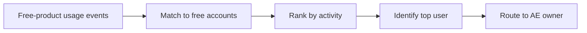

# Free-Tier Usage Alert For AEs

## Problem Statement

Free-product usage is valuable only if someone acts on it.

## Output

This project produces an AE-ready usage alert.

```text
Top free-tier usage accounts: 2026-03-05 to 2026-03-11
1. Free Freeworkspace099 | owner=AE_5 | owner_role=AE | events=7 | users=4 | top user=user2@freeworkspace099.com (43%)
2. Free Freeworkspace186 | owner=AE_8 | owner_role=AE | events=7 | users=4 | top user=user1@freeworkspace186.com (43%)
3. Free Freeworkspace002 | owner=AE_4 | owner_role=AE | events=7 | users=3 | top user=user3@freeworkspace002.com (43%)
4. Free Freeworkspace003 | owner=AE_7 | owner_role=AE | events=7 | users=3 | top user=user4@freeworkspace003.com (71%)
5. Free Freeworkspace175 | owner=AE_8 | owner_role=AE | events=6 | users=4 | top user=user2@freeworkspace175.com (33%)
```

The output is simple: who is active, who owns it, and who the most engaged user is.

## Logic



Free-product accounts resolve to AEs through canonical ownership.

## Technical

- 7-day lookback
- free-product accounts only
- ranks by total events and active users
- exports:
  - `output/free_tier_usage_alerts.csv`
  - `output/slack_message_payload.csv`
  - `output/salesforce_tasks.csv`

Run:

```bash
python3 projects/03_freetier_usage_alert/freetier_usage_alert.py
```
