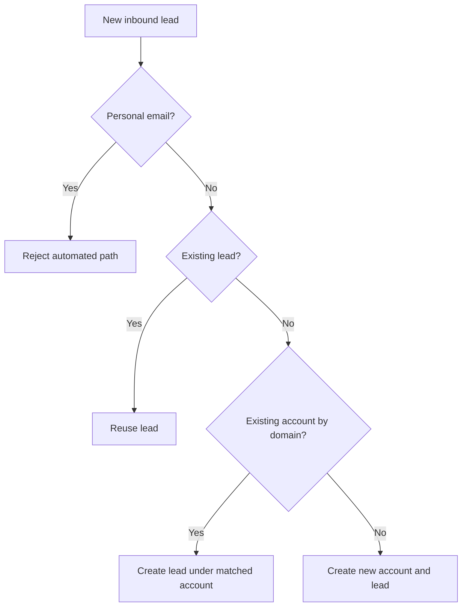

# Lead Enrichment With Clay

## Problem Statement

Inbound leads lose value when routing is slow or unclear. This project shows how to decide quickly whether the lead belongs to an existing account, an existing lead, or a brand-new record.

## Output

- `output/lead_enrichment_scenarios.csv`

What comes out:
- the path taken for each lead scenario
- matched account context
- matched owner context
- the next action the system would take

## Logic



The important business idea is simple: reuse what already exists before creating anything new.

## Technical

- checks personal email vs company email
- checks for existing lead by email
- checks for existing account by domain
- enriches the record with Clay-style data
- reports canonical owner and account segment when an account match exists

Run:

```bash
python3 projects/04_lead_enrichment/lead_enrichment.py --scenario all
```
