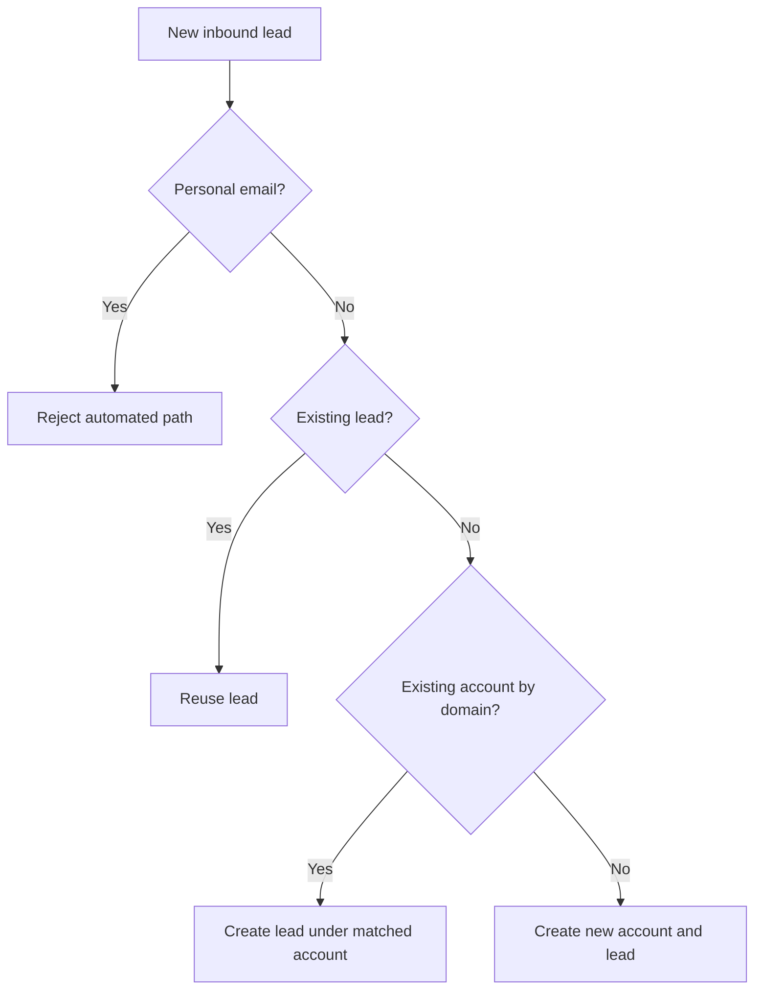

# Lead Enrichment With Clay

## Problem Statement

Inbound leads slow down when the system cannot quickly tell whether they belong to an existing record or need a new one.

## Output

This project shows how inbound lead data is verified, enriched, matched, and written back into Salesforce-style records.

### Scenario Results

| Scenario | Path | Account Segment | Matched Owner | Owner Role |
|---|---|---|---|---|
| `existing_lead` | existing lead reused | SMB | AE_5 | AE |
| `matched_account` | new lead under matched account | Mid-Market | AM_5 | AM |
| `net_new` | new account and new lead | SMB |  |  |
| `personal_email` | rejected |  |  |  |

### Example: What Came In vs What The System Resolved

| Stage | Value |
|---|---|
| Inbound email | `newperson@company050.com` |
| Inbound company | `Company050 Labs` |
| Matched account | `001000000050` |
| Matched segment | `Mid-Market` |
| Matched owner | `AM_5` |
| Matched owner role | `AM` |
| Enriched company name | `Company050 Labs` |
| Enriched job title | `Operations Leader` |

The value is clarity: the system tells you whether to reuse, attach, or create while improving the quality of the CRM record.

## Logic



Reuse what exists before creating anything new.

## Technical

- lead intake, company-email verification, CRM matching, enrichment, and Salesforce update
- checks email type
- checks for existing lead by email
- checks for existing account by domain
- enriches person and company fields
- exports:
  - `output/lead_enrichment_scenarios.csv`

Run:

```bash
python3 projects/04_lead_enrichment/lead_enrichment.py --scenario all
```
