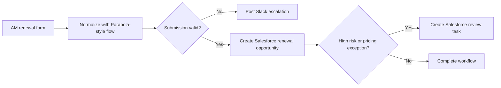

# AM Renewal Form Automation

## Introduction

AM renewal operations often start with manual form submissions that have to be validated, routed, and written back into downstream systems before anyone can act on them.

## Output

This project represents a Parabola-style workflow for AM renewal form automation, turning renewal form submissions into validated Salesforce renewal opportunities, follow-up tasks, and Slack notifications.

### Example Outcomes

| Submission | Path | Status | Output |
|---|---|---|---|
| `renewal_form_001` | clean renewal submission | processed | renewal opportunity created |
| `renewal_form_002` | high-risk pricing exception | processed | renewal opportunity + review task |
| `renewal_form_003` | owner mismatch | blocked | Slack escalation |
| `renewal_form_004` | missing forecast | blocked | Slack escalation |

The value is speed and consistency: AMs submit one form, and the workflow handles validation, record creation, and downstream routing automatically.

## Logic



## Technical

- Parabola-style form normalization and validation
- Salesforce renewal opportunity creation
- Slack escalation and notification payloads
- exports:
  - `output/parabola_flow_runs.csv`
  - `output/renewal_form_processing_results.csv`
  - `output/salesforce_renewal_opportunities.csv`
  - `output/salesforce_tasks.csv`
  - `output/slack_message_payloads.csv`

Run:

```bash
python3 projects/workflows/05_am_renewal_form_automation/am_renewal_form_automation.py
```
